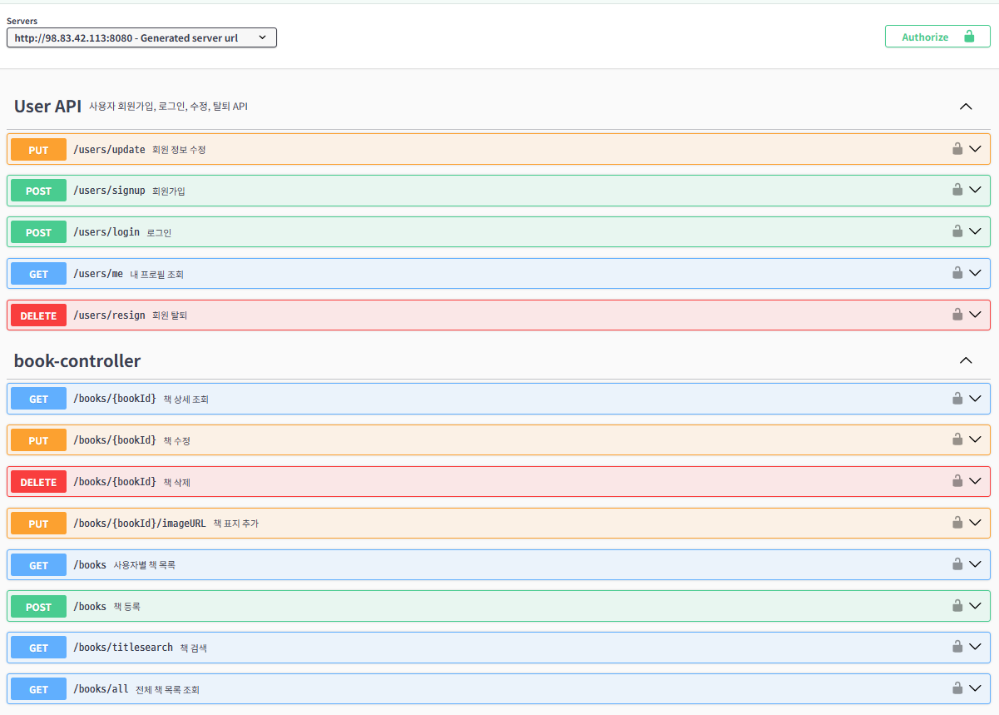
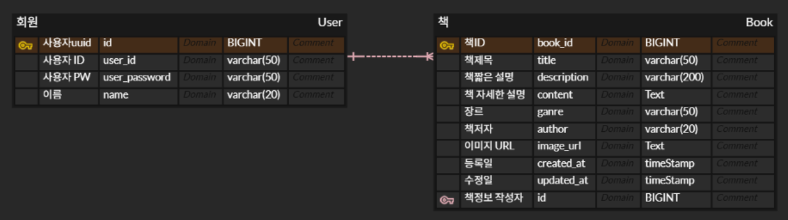
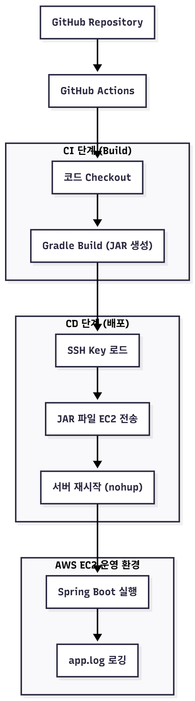
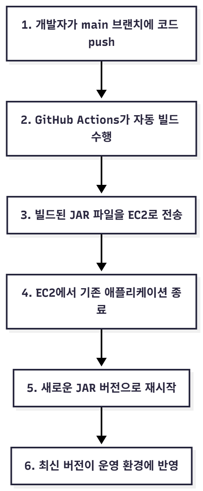

# AivleSchool 4th Mini Project — Backend

## AI 이미지 생성 기반 도서 관리 시스템 (Backend)

> 본 프로젝트는 AI 이미지 생성 모델을 활용하여 도서 표지를 자동 생성하고,
사용자·도서 정보를 효율적으로 관리할 수 있는 백엔드 시스템을 구현하는 것을 목표로 진행되었습니다.
Spring Boot 기반의 REST API 서버로 설계되었으며, 회원 인증, 도서 CRUD, 이미지 생성 연동 등의 핵심 기능을 제공합니다.

## Backend Contributors
| ‍이름 | 담당 업무                                                                                                                                                           |
|----------|-----------------------------------------------------------------------------------------------------------------------------------------------------------------|
| **서범수** | • [GitHub Actions + AWS EC2 기반 CI/CD 구축](#github-actions--aws-ec2-기반-자동-배포-환경-구축) <br> • [Global Exception & User 에러 처리](#도메인-기반-예외-처리-구조화) <br> • JWT 인증/인가 구현 |
| **장혁준** | • [Book 예외 처리](#도메인-기반-예외-처리-구조화) <br> • [Book Service 트랜잭션 적용](#트랜잭션-기반-BookService-설계) <br> • Book 도메인 설계 및 CRUD 구현 <br> • 검색 & 이미지 URL 저장 API 개발 <br>        |
| **정현호** | • User 도메인 설계 및 CRUD 구현                                                                                                                                         |
| **유대영** | • User 도메인 설계 및 CRUD 구현                                                                                                                                         |

## 프로젝트 핵심 목표

| 구분 | 상세 내용                                                                                     |
|------|-------------------------------------------------------------------------------------------|
| **인증 & 보안** | - JWT 기반 인증/인가 <br> - [Global Exception 구조 적용]((#도메인-기반-예외-처리-구조화))                       |
| **도서 관리 기능** | - Book/User CRUD API 구현 <br> - 이미지 URL 저장 및 검색 기능 <br> - [@Transactional 기반 안정적 서비스 처리](#트랜잭션-기반-BookService-설계) |
| **AI 기능** | - AI 이미지 생성 API 연동하여 표지 자동 생성                                                             |
| **개발 효율** | - Swagger UI 문서 자동화 <br> - JPA/Hibernate 기반 도메인 설계                                        |

## 시스템 전체 구조

### **전체 구현 목록 - Swagger 문서**



### **ERD 다이어그램**



### **배포 아키텍쳐**
<table>
  <tr>
    <td align="center" width="49%">
      <h3>아키텍처</h3>
      
    </td>
    <td align="center" width="49%">
      <h3>동작 흐름</h3>
      
    </td>
  </tr>
</table>

## 상세 기술구현
본 프로젝트 구현 과정에서 특히 심도 있게 다뤘던 부분은 아래 세 가지입니다.

1) [트랜잭션 기반 BookService 설계](#트랜잭션-기반-BookService-설계)
2) [GitHub Actions + AWS EC2 기반 CI/CD 구축](#github-actions--aws-ec2-기반-자동-배포-환경-구축)
3) [도메인 기반 예외 처리 구조화](#도메인-기반-예외-처리-구조화)

### 트랜잭션 기반 BookService 설계

#### 1) 쓰기 작업 (CUD)에 @Transactional 적용

책 등록/ 수정/ 삭제와 같이 데이터 상태가 변경되는 작업에는 기본 @Transactional을 적용하여 다음을 보장했다:

- 작업 도중 예외가 발생하면 자동 롤백
- 하나의 비즈니스 로직을 원자적(Atomic)으로 처리
- 데이터 일관성(Consistency)유지

```java
@Transactional
public BookDetailResponse updateBook(...) { ... }
```

#### 2) 조회 작업에 @Transactional(readOnly = true)적용

책 상세 조회/ 목록 죄회 등 읽기 전용 작업에는 성능 최적화를 위해 readOnly = true 옵션을 부여했다. 이 옵션을 사용했을때의 효과는 다음과 같다.

- JPA가 해당 트랜잭션에서는 쓰기 관련 변경 감지를 수행하지 않음 → 성능 향상
- 불필요한 flush 방지
- 조회 전용 쿼리의 효율적 실행

```java
@Transactional(readOnly = true)
public BookDetailResponse getBook(...) { ... }
```

#### 3) 정리

Book 도메인 개발 과정에서 Spring의 트랜잭션 전파 및 관리 개념을 적용. 데이터 변경이 발생하는 기능에는 @Transactional을 적용해 안정적인 롤백/커밋 구조를 구축했고, 조회 기능에는 @Transactional(readOnly = true)를 적용하여 성능 최적화를 달성. 이를 통해 “기능구현”이 아닌 “안정적인 서버 설계”의 중요성을 깨달았다.

---

### GitHub Actions + AWS EC2 기반 자동 배포 환경 구축

프로젝트의 백엔드 배포 환경을 표준화하고 안정성을 확보하기 위해**GitHub Actions**와 **AWS EC2**를 활용한 **CI/CD 자동 배포 파이프라인**을 구축했습니다. 기존의 수동 배포 방식은 로컬 환경에서 빌드 후 EC2로 직접 업로드하는 방식이었고, 개발자별 환경 차이 및 배포 과정 누락으로 인해 운영의 일관성이 떨어지는 문제가 있었습니다.

#### 1) 설계 목표<br>
- **배포 자동화**: main 브랜치 push → 자동 빌드 → 자동 배포
- **환경 일관성 확보**: 팀원 전체가 동일한 방식으로 배포
- **보안 강화**: SSH Key, Host IP 등을 GitHub Secrets로 관리

*(CI/CD 전체 구조는 위의 “배포 아키텍처” 섹션 참고)*

#### 2) GitHub Actions Workflow
1. **빌드 설정**
   - Temurin JDK 21 설정
   - Gradle 캐시를 사용해 빌드 속도 최적화
   - ./gradlew clean build' 수행하여 JAR 생성

2. **배포 단계**
   - GitHub Secrets에 저장된 SSH 키로 인증
   - `scp`를 이용해 EC2 배포 디렉토리(`~/app/`)로 JAR 파일 업로드
   - SSH 접속 후 기존 프로세스를 `pkill`로 종료
   - `nohup`을 사용하여 백그라운드에서 Spring Boot 실행

```yaml
name: Build and Deploy to EC2

on:
  push:
    branches: [ "main" ]

jobs:
  deploy:
    runs-on: ubuntu-latest

    steps:
    - uses: actions/checkout@v3

    - name: Set up JDK 21
      uses: actions/setup-java@v4
      with:
        distribution: 'temurin'
        java-version: '21'

    - name: Build with Gradle
      run: ./gradlew clean build

    - name: Copy JAR to EC2
      run: scp -i ${{ secrets.EC2_KEY }} ./build/libs/*.jar ubuntu@${{ secrets.EC2_HOST }}:/home/ubuntu/app/

    - name: Restart Application
      run: |
        ssh -i ${{ secrets.EC2_KEY }} ubuntu@${{ secrets.EC2_HOST }} << 'EOF'
        pkill -f jar || true
        nohup java -jar /home/ubuntu/app/*.jar > app.log 2>&1 &
        EOF
```

#### 3) EC2 서버 환경 구성

1. OS & 런타임
   - Ubuntu 22.04
   - JDK 21 설치
   - 필요한 포트 인바운드 설정 (8080)

2. 실행 방식
   - `nohup java -jar app.jar &`
   - SSH 종료 후에도 서버가 계속 실행되도록 백그라운드 구동
   - log 파일로 실시간 모니터링 가능 (`tail -f app.log`)

#### 4) 효과 및 인사이트

- CI/CD 구축을 통해 빌드부터 배포까지의 과정이 완전히 자동화되면서 10분정도 걸리는 배포가 2분정도로 감소되어 개발 효율이 향상되었다.
- GitHub Actions가 남겨주는 빌드·배포 로그 덕분에 문제 발생 시 원인 추적이 용이해졌고, EC2 서버에는 항상 최신 버전이 자동 반영되어 운영 안정성도 강화되었다.
- 이를 직접 설계하며 GitHub Secrets 기반의 보안 관리, SSH 인증 구조 같은 실제 DevOps 기술들을 체험할 수 있었고, 단순히 코드를 잘 작성하는 것만으로는 충분하지 않으며, 서비스를 안정적으로 운영하는 능력이 백엔드 개발자에게 필수적이라는 점을 깊이 체감할 수 있었다.
- 결국 CI/CD는 편의를 위한 기능이 아니라 서비스 품질을 유지하는 핵심 도구라는 사실을 실무적으로 이해하게 되었다.

--- 

### 도메인 기반 예외 처리 구조화

#### 1) 도메인에 맞춘 에러 구조 확장

GlobalException구조를 기반으로, Book 도메인에서 발생하는 예외를 명확하게 분리하기 위해 ErrorCode Enum에 Book관련 항목을 추가하였다.

```java
BOOK_NOT_FOUND(HttpStatus.NOT_FOUND, "책을 찾을 수 없습니다."),
INVALID_BOOK_TITLE(HttpStatus.BAD_REQUEST, "책 제목은 필수 입력값입니다."),
```

이로써 예외 상황을 일관된 포멧으로 처리할 수 있었고, 서비스 전반에서 표준화된 에러 응답 구조를 유지할 수 있게 되었다.

#### 2) RuntimeException → CustomException 통합 적용

초기에는 책을 찾지 못했을 때 RUNTIMEEXCEPTION (”BOOK NOT FOUND”)와 같은 방식으로 처리했으나, 이는 응답 형태가 통일되지 않고, API명세서와 실제 응답이 달라질 수 있는 문제가 있었다.

이를 해결하기 위해 :

- BookService 내부에서 발생하는 모든 예외를 new CustomException(ErrorCode.BOOK_NOT_FOUND) 형식으로 변경
- GlobalExceptionHandler가 이를 받아 JSON 형태의 통일된 응답으로 변환

이로써 API응답 형태가 프로젝트 전체에서 완전히 통합되었고, 에러처리 규칙이 명확해져 프론트엔드와의 협업이 수월해졌다. 또한 디버깅 및 유지보수 편의성이 향상되었다.

#### 3) DTO 단에서 입력값 검증 추가

DTO에서 공백 또는 누락된 입력값을 서버까지 전달되지 않도록 요청 데이터 검증(Validation)을 사전에 적용

```java
public class BookCreateRequest {
    @NotBlank(message = "책 제목은 필수 입력값입니다.")
    private String title;

    @NotBlank(message = "내용을 입력해주세요.")
    private String content;
}
```

이를 통해 서버 내부로직에 잘못된 데이터가 전달되는 것을 사전에 차단했고, 에러 메시지 또한 사용자 친화적으로 표시할 수 있었다.

#### 4) Controller에서 @Valid적용하여 Validation 활성화

DTO에 @NotBlank를 선언하는 것만으로는 검증이 실항되지 않음.

이를 실제로 동작시키기 위해 Controller에서 다음과 같이 @Valid를 추가했다.

```java
public BookDetailResponse createBook(
        @RequestParam Long userId,
        @Valid @RequestBody BookCreateRequest request
) {
    return bookService.createBook(userId, request);
}
```

이를 통해 요청이 Controller에 도달하는 시점에서 잘못된 값을 자동 찬단하였고,

GlobalExceptionHandler가 MethodArgumentNotValidException을 받아 일관된 에러 응답으로 반환하였다.

#### 5) 정리

프로젝트의 안정성과 유지보수성을 높이기 위해 Book, User 도메인에 대해 예외 처리 전반을 명확하게 구조화하였다.

- ErrorCode에 도메인별 예외 추가
- BookService, UserService에서 RuntimeException제거 후 CustomException적용
- DTO에 입력 검증 (@NotBlank) 도입
- Controller에 @Valid 적용하여 검증 활성화

이를 통해 API에러 응답 형식이 통합되고, 프론트엔드 협업 과정에서 데이터 검증 및 에러 핸들링이 훨씬 명확해졌다.
